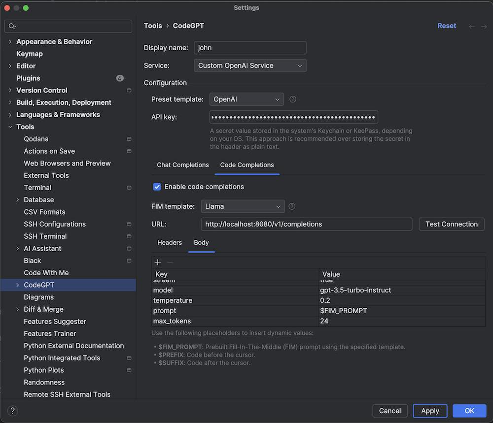

# OpenAI generate to Ollama generate proxy
Proxy used to convert requests intended for OpenAI v1/generate endpoint to Ollama generate endpoint. Ollama does not provide OpenAI-compatible endpoint for text completion, only for chat completion. Proxy can be used in plugins like CodeGPT to provide code completion using Ollama models.

### Run proxy
With watch:
`npm run dev`

Without watch:
`npm run start`

Server listens on http://localhost:8080/v1/completions and conforms to the OpenAI v1/generate specification (only streaming is supported now).

Proxy respond with fake "usage", "id", dates etc. and "choices" array with the result of Ollama generation.

### Configuring CodeGPT in jetbrains IDE
Most settings are ignored, except prompt which must be in correct fill-in-the-middle format. For llama models (like codellama used by default in the proxy) select FIM template "Ollama" and set prompt body field to $FIM_PROMPT.

